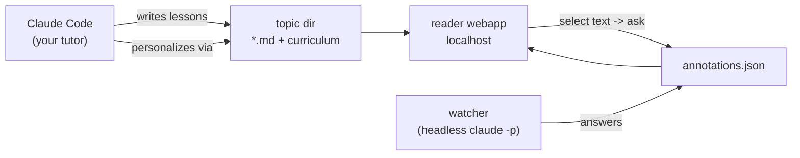

# study-tutor

A personal AI study tutor as a [Claude Code](https://claude.com/claude-code) skill. Claude teaches you a topic in structured lessons, saves everything as condensed, revisit-friendly study notes, and you read them in a local web reader where you can **select any passage and ask a question** (or just flag "❓ don't get it"). A background watcher answers your questions within seconds using headless Claude — with proper math rendering, threaded follow-ups, and a curriculum that adapts to how you learn.



## What you get

- **Lessons as notes, not chat scrollback** — timestamped markdown, condensed for spaced revisiting, with KaTeX math and mermaid diagrams rendered.
- **Annotate-to-ask** — highlight anything in a note, ask a question or flag it; answers appear in the margin panel, threaded, within ~30s.
- **A tutor that remembers** — `curriculum.md` tracks your profile, progress, and what the tutor learns about how you learn.
- **Multiple topics** — each topic is one folder with its own port; they run side by side.
- Fully local: stdlib Python server, vendored assets (KaTeX, mermaid, marked), works offline except for answering questions.

## Requirements

- [Claude Code](https://claude.com/claude-code) installed and logged in (`claude` on PATH)
- Python 3.9+ (preinstalled on macOS)
- macOS or Linux

> **Cost note:** the watcher answers questions by running `claude -p` **on your account** — each answer is one real model call (polling itself is free and local).

## How to install

```bash
git clone https://github.com/hehkcaspar/study-tutor.git ~/.claude/skills/study-tutor
```

That's it. Open Claude Code anywhere and say:

> **set up my study tutor — I want to learn `<topic>`**

Claude (via the skill) checks prerequisites, scaffolds your topic folder, interviews you for a learner profile, writes lesson 1, and launches the reader in its own terminal window. Update later with `git -C ~/.claude/skills/study-tutor pull`.

## Manual usage (without asking Claude)

```bash
ENGINE=~/.claude/skills/study-tutor/engine
bash $ENGINE/init.sh ~/topics/quantum "Quantum Computing"   # scaffold a topic
bash $ENGINE/start.sh ~/topics/quantum                      # reader + watcher (keep window open)
```

The reader runs at `http://127.0.0.1:<port>` (port auto-assigned per topic, shown on start). The tutor-scan interval (5–30s) is adjustable in the reader's sidebar.

## Layout

| Path | What |
|---|---|
| `SKILL.md` | the tutoring workflow Claude follows |
| `engine/serve.py` | local server: notes + annotations/settings API (stdlib only) |
| `engine/app.html` | reader webapp (marked + KaTeX + mermaid, vendored) |
| `engine/tutor_answer.py` | answers open annotations via headless `claude -p` |
| `engine/tutor_watch.sh` | scan loop (interval configurable from the reader) |
| `engine/start.sh` / `engine/init.sh` | run a topic / scaffold a new one |
| `<your topic dir>` | just content: `*.md`, `annotations.json`, `settings.json` |

## License

MIT
